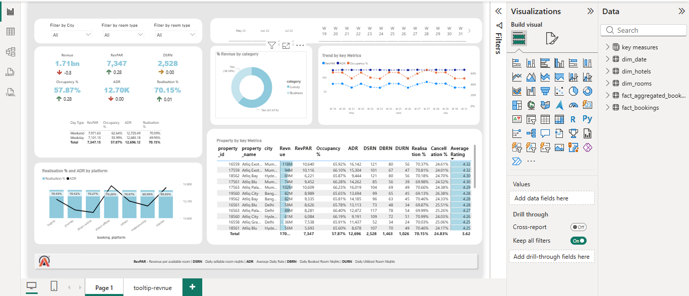
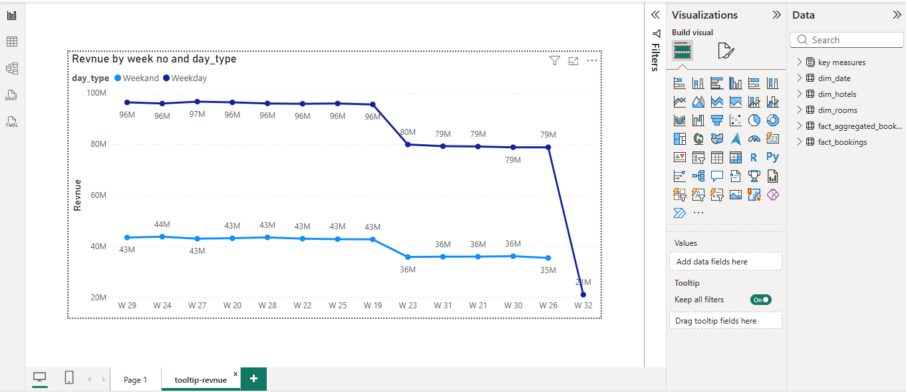

# Hospitality Analysis – Revenue & Occupancy

## Overview
Hospitality analytics project to identify reasons for revenue decline.

## Tools Used
- Power BI
- Excel

## Key Highlights
- Analyzed ₹1.7B+ revenue, occupancy (~70%), ADR & RevPAR
- Compared weekday vs weekend performance
- Suggested actions for ~20% revenue recovery

## Dashboard Preview

